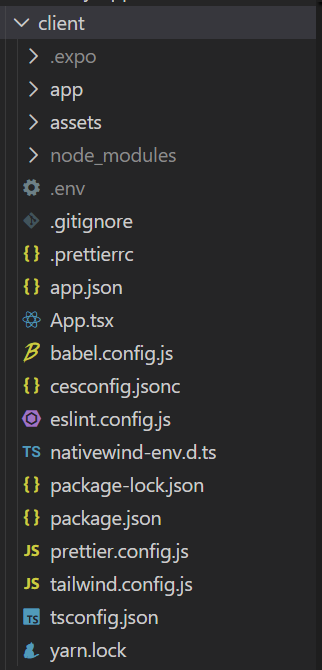
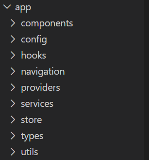
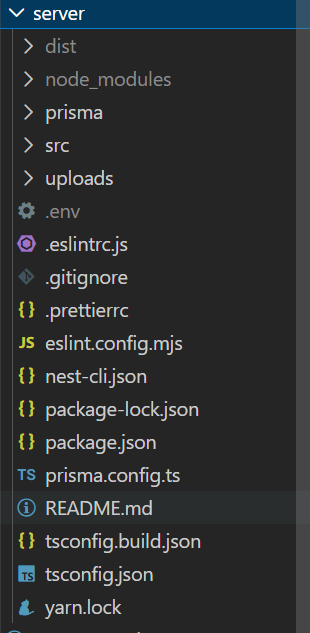

# Delivery App Record

**Автор:** Мухаметов С.М.
**Группа:**  ТОП-ИТ-101Б

## Описание проекта

Мобильное клиентно-серверное  приложение (монолит) , по функционалу что-то среднее между самокатом и kfc  
Пользователь может просматривать каталог товаров, добавлять их в корзину, оформлять заказ и оплачивать через Stripe (в данном случае в тестовом режиме).  
Приложение имеет полноценную JWT-аутентификацию с обновлением токенов, историю заказов и выбором избранного.

##  Структура проекта

### Клиент
 

Папка app  

delivery-app-record/ 
├── client/ # React Native (Expo) клиент 
│ ├── app/ 
│ │ ├── components/ # UI-компоненты (категории, продукты, корзина, поиск и другие скрины) 
│ │ ├── config/ # Определяет базовые URL для API и вспомогательные функции для построения эндпоинтов. 
│ │ ├── navigation/ # Настройка навигации (стек, вкладки) 
│ │ ├── providers/ # Провайдеры (Auth, Stripe, Redux) 
│ │ ├── services/ # API-клиенты (order, auth, product) 
│ │ ├── store/ # Redux store + slices (корзина, избранное) 
│ │ ├── types/ # TypeScript интерфейсы (auth, user) 
│ │ └── utils/ # Утилиты (converPrice, getMediaSource) 

Файлы и структура 

* Точка входа: client/App.tsx

    &mdash; Обёртки: QueryClientProvider (React Query), Provider (Redux), PersistGate (Redux Persist), AuthProvider (кастомный), SafeAreaProvider, StripeProvider 
    &mdash; Улитка: Navigation компонент. 

* Навигация: client/app/navigation/

    &mdash; Navigation.tsx – главный контейнер, проверяет user и рендерит BottomMenu. 
    &mdash; PrivateNavigator.tsx – условный рендеринг (Auth или экраны). 
    &mdash; routes.ts – список экранов (Home, Favorites, Cart, Profile, etc.). 

* Управление состоянием:

    &mdash; Redux Toolkit – корзина (cart.slice), избранное (favorites.slice). 
    &mdash; React Query – для данных с сервера (продукты, категории, профиль). 
    &mdash; Redux Persist – сохранение корзины и избранного в AsyncStorage. 

* Сервисы API: client/app/services/

    &mdash; order.service.ts, product.service.ts, category.service.ts, user.service.ts, auth.service.ts. 
    &mdash; api/request.api.ts – обёртка над Axios с тостами. 
    &mdash; api/interceptors.api.ts – перехватчик: добавляет Bearer токен, обрабатывает 401 и обновление токенов. 
    &mdash; api/helper.auth.ts – функция getNewTokens(запрашивает у сервера токены). 
    &mdash; auth/auth.helper.ts – работа с SecureStore (сохранение/чтение токенов). 

* Аутентификация:

    &mdash; AuthProvider.tsx – контекст с user, isLoading, проверка токена при старте. 
    &mdash; useCheckAuth.ts – проверяет refresh token при смене маршрута. 
    &mdash; useAuth.ts – хук для доступа к контексту. 

* Экраны:

    &mdash; auth/Auth.tsx – форма входа/регистрации. 
    &mdash; home/Home.tsx – главный экран (Header, Banner, Categories, Products). 
    &mdash; cart/Cart.tsx – корзина, кнопка оформления заказа. 
    &mdash; profile/Profile.tsx – профиль, кнопка Logout, избранное. 
    &mdash; product/Product.tsx – детальная карточка товара. 
    &mdash; order/ – экран спасибо. 

* Хуки:

    &mdash; useCart.ts – доступ к корзине из Redux. 
    &mdash; useCheckout.ts – оформление заказа (сборка данных, вызов Stripe). 
    &mdash; useProfile.ts – запрос профиля через React Query. 

* Утилиты:

    &mdash; converPrice.ts – форматирует как доллары с центами. 
    &mdash; getMediaSource - помогает с фотографиями, "строит пути" 

* Стилизация: NativeWind (Tailwind CSS).

### Серверная часть (NestJS)

Папка src

Главный файл: server/src/main.ts

setGlobalPrefix('api')

useStaticAssets для папки uploads

Глобальный фильтр исключений TokenExpiredFilter (превращает TokenExpiredError в 401)

Модули:

AuthModule – логин, регистрация, выдача/обновление токенов.

UserModule – профиль, избранное.

CategoryModule – категории (CRUD).

ProductModule – продукты (CRUD, поиск по категориям).

OrderModule – заказы, Stripe интеграция.

Аутентификация:

jwt.strategy.ts – валидация JWT, ignoreExpiration: false, возвращает null → 401.

auth.service.ts – login, register, issueTokens (access: 1h, refresh: 7d).

Кастомный декоратор @Auth() – UseGuards(AuthGuard('jwt')).

Декоратор @CurrentUser('id') – извлекает user.id из request.user.

Работа с БД: PrismaService (в utisl/prisma.service.ts).

Модели: User, Product, Category, Order, OrderItem.

seed.ts – заполнение категорий, продуктов, демо-пользователя.

Заказы и Stripe:

order.controller.ts – POST /orders (с @Auth()), принимает OrderDto (items).

order.service.ts – вычисляет total из items (цены в центах), создаёт заказ в БД, затем создаёт PaymentIntent в Stripe с amount: total (total уже в центах – исправлено), возвращает clientSecret.

Stripe инициализируется с process.env.STRIPE_SECRET_KEY.

Статика: ServeStaticModule раздаёт папку uploads по /uploads.
