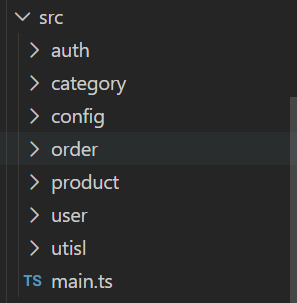
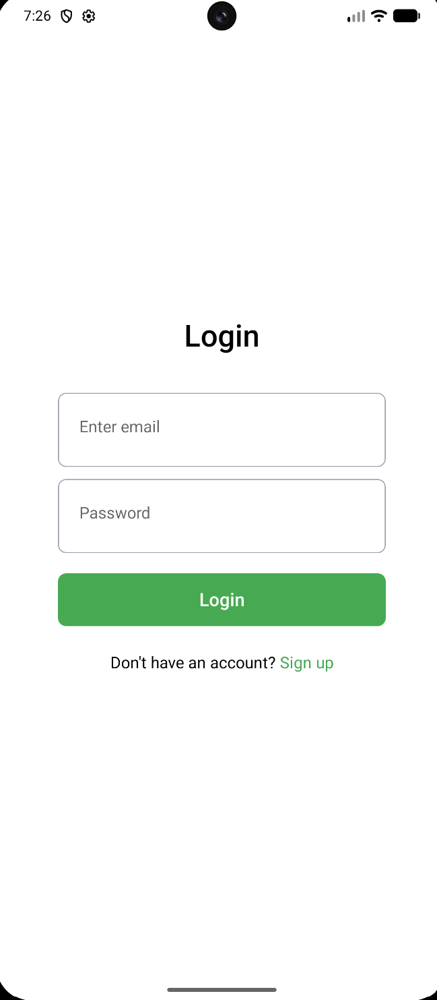
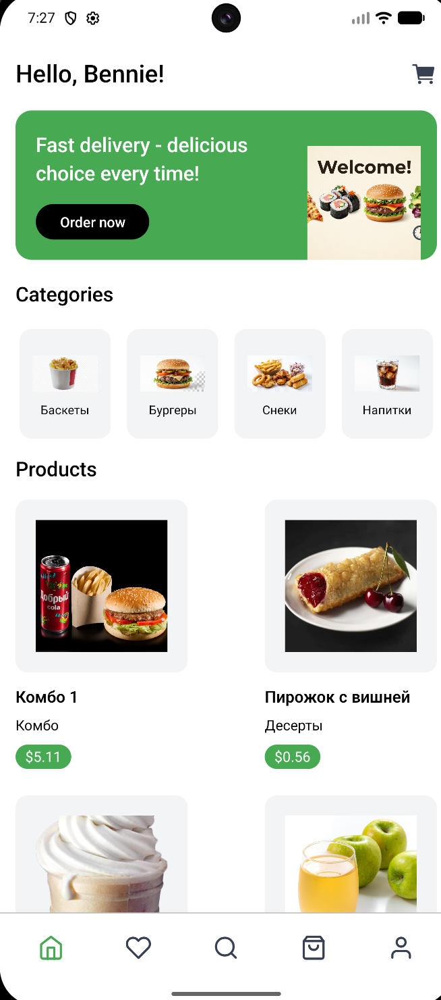
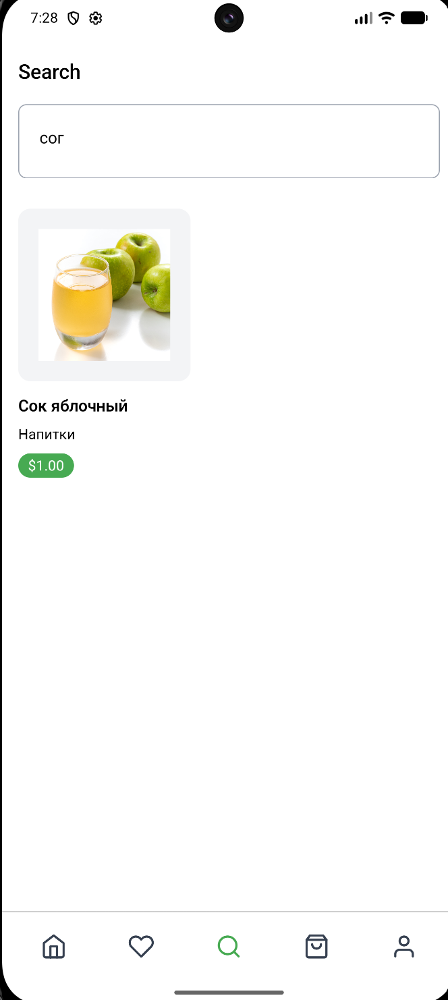
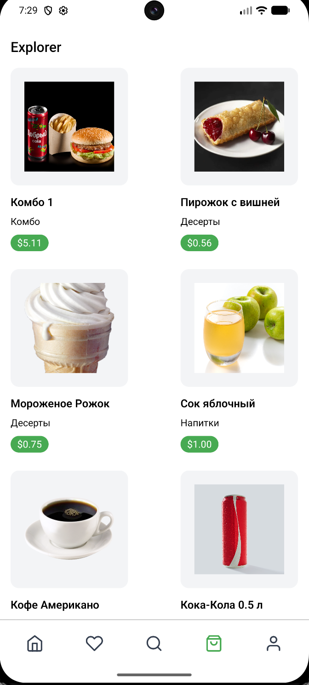
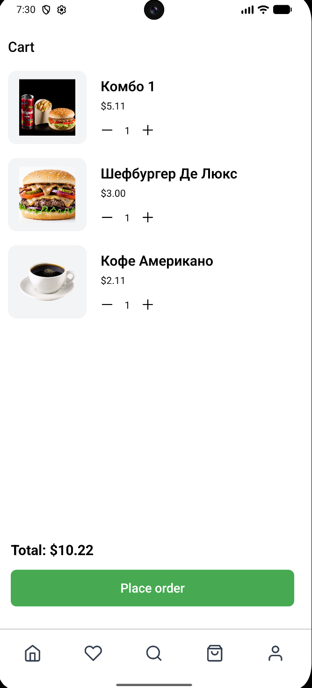
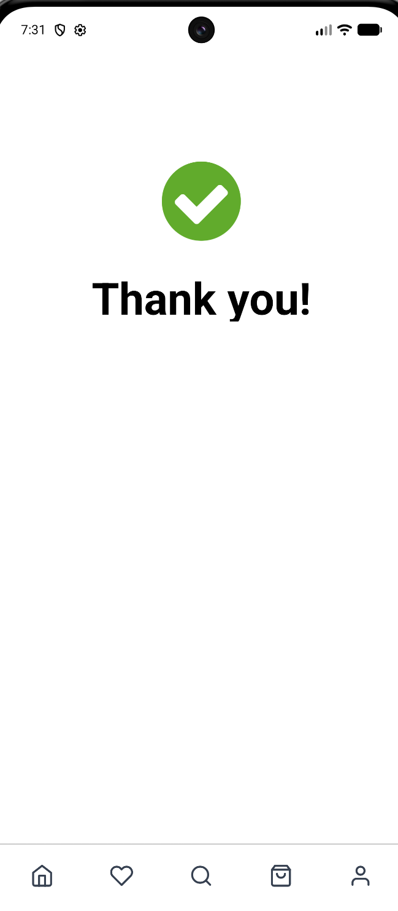

# Delivery App Record

**Автор:** Мухаметов С.М.
**Группа:**  ТОП-ИТ-101Б

## Описание проекта

Мобильное клиентно-серверное  приложение (монолит) , по функционалу что-то среднее между самокатом и kfc  
Пользователь может просматривать каталог товаров, добавлять их в корзину, оформлять заказ и оплачивать через Stripe (в данном случае в тестовом режиме).  
Приложение имеет полноценную JWT-аутентификацию с обновлением токенов, историю заказов и выбором избранного.

##  Структура проекта

### Клиент
 

Папка app  

delivery-app-record/ 
├── client/ # React Native (Expo) клиент 
│ ├── app/ 
│ │ ├── components/ # UI-компоненты (категории, продукты, корзина, поиск и другие скрины) 
│ │ ├── config/ # Определяет базовые URL для API и вспомогательные функции для построения эндпоинтов. 
│ │ ├── navigation/ # Настройка навигации (стек, вкладки) 
│ │ ├── providers/ # Провайдеры (Auth, Stripe, Redux) 
│ │ ├── services/ # API-клиенты (order, auth, product) 
│ │ ├── store/ # Redux store + slices (корзина, избранное) 
│ │ ├── types/ # TypeScript интерфейсы (auth, user) 
│ │ └── utils/ # Утилиты (converPrice, getMediaSource) 
└── другие файлы (линтеры, файлы окружения и настройки) 

Файлы и структура 

* Точка входа: client/App.tsx

    &mdash; Обёртки: QueryClientProvider (React Query), Provider (Redux), PersistGate (Redux Persist), AuthProvider (кастомный), SafeAreaProvider, StripeProvider 
    &mdash; Улитка: Navigation компонент. 

* Навигация: client/app/navigation/

    &mdash; Navigation.tsx – главный контейнер, проверяет user и рендерит BottomMenu. 
    &mdash; PrivateNavigator.tsx – условный рендеринг (Auth или экраны). 
    &mdash; routes.ts – список экранов (Home, Favorites, Cart, Profile, etc.). 

* Управление состоянием:

    &mdash; Redux Toolkit – корзина (cart.slice), избранное (favorites.slice). 
    &mdash; React Query – для данных с сервера (продукты, категории, профиль). 
    &mdash; Redux Persist – сохранение корзины и избранного в AsyncStorage. 

* Сервисы API: client/app/services/

    &mdash; order.service.ts, product.service.ts, category.service.ts, user.service.ts, auth.service.ts. 
    &mdash; api/request.api.ts – обёртка над Axios с тостами. 
    &mdash; api/interceptors.api.ts – перехватчик: добавляет Bearer токен, обрабатывает 401 и обновление токенов. 
    &mdash; api/helper.auth.ts – функция getNewTokens(запрашивает у сервера токены). 
    &mdash; auth/auth.helper.ts – работа с SecureStore (сохранение/чтение токенов). 

* Аутентификация:

    &mdash; AuthProvider.tsx – контекст с user, isLoading, проверка токена при старте. 
    &mdash; useCheckAuth.ts – проверяет refresh token при смене маршрута. 
    &mdash; useAuth.ts – хук для доступа к контексту. 

* Экраны:

    &mdash; auth/Auth.tsx – форма входа/регистрации. 
    &mdash; home/Home.tsx – главный экран (Header, Banner, Categories, Products). 
    &mdash; cart/Cart.tsx – корзина, кнопка оформления заказа. 
    &mdash; profile/Profile.tsx – профиль, кнопка Logout, избранное. 
    &mdash; product/Product.tsx – детальная карточка товара. 
    &mdash; order/ – экран спасибо. 

* Хуки:

    &mdash; useCart.ts – доступ к корзине из Redux. 
    &mdash; useCheckout.ts – оформление заказа (сборка данных, вызов Stripe). 
    &mdash; useProfile.ts – запрос профиля через React Query. 

* Утилиты:

    &mdash; converPrice.ts – форматирует как доллары с центами. 
    &mdash; getMediaSource - помогает с фотографиями, "строит пути" 

* Стилизация: NativeWind (Tailwind CSS).

### Серверная часть (NestJS)

Папка src 

delivery-app-record/ 
├── server/ # NestJS бэкенд 
│ ├── prisma/ # Схема БД и seed-данные(заполнение бд) 
│ ├── src/ 
│ │ ├── auth/ # Модуль аутентификации (JWT, стратегии) 
│ │ ├── user/ # Пользователи (профиль, избранное, модели) 
│ │ ├── product/ # Продукты 
│ │ ├── category/ # Категории  
│ │ ├── order/ # Заказы + интеграция со Stripe 
│ │ ├── utisl/ # Утилиты (prisma.service, app.module) 
│ │ └── main.ts # Главный файл (глобальные настройки) 
│ └── uploads/ # Статические изображения 
└── другие файлы (линтеры, файлы окружения и настройки) 

Файлы и структура 

* Главный файл: server/src/main.ts - точка входа

    &mdash; setGlobalPrefix('api')
    &mdash; useStaticAssets для папки uploads

* Модули:

    &mdash; AuthModule – логин, регистрация, выдача/обновление токенов.
    &mdash; UserModule – профиль, избранное.
    &mdash; CategoryModule – категории (CRUD).
    &mdash; ProductModule – продукты (CRUD, поиск по категориям).
    &mdash; OrderModule – заказы, Stripe интеграция.

* Аутентификация:

    &mdash; jwt.strategy.ts – валидация JWT, ignoreExpiration
    &mdash; auth.service.ts – login, register, issueTokens (access: 1h, refresh: 7d).
    &mdash; Кастомный декоратор @Auth() – UseGuards(AuthGuard('jwt')).
    &mdash; Декоратор @CurrentUser('id') – извлекает user.id из request.user.

* Работа с БД: PrismaService (в utisl/prisma.service.ts) + PostgreSQL.

    &mdash; Модели: User, Product, Category, Order, OrderItem.
    &mdash; seed.ts – заполнение категорий, продуктов, демо-пользователя.

* Заказы и Stripe:

    &mdash; order.controller.ts – POST /orders (с @Auth()), принимает OrderDto (items).
    &mdash; order.service.ts – вычисляет total из items (цены в центах), создаёт заказ в БД, затем создаёт PaymentIntent в Stripe с amount: total (total уже в центах – исправлено), возвращает clientSecret.
    &mdash; Stripe инициализируется с process.env.STRIPE_SECRET_KEY.
    &mdash;Статика: ServeStaticModule раздаёт папку uploads по /uploads.

## Как выглядит приложение / ui

### Экран авторизации  

  

### Экран "Дома"  

  

### Экран "Любимого"  

  

### Экран "поиска"  

  

### Экран "всех товаров"  

  

### Экран "всех товаров"  

  

### Экран "Корзины"  

  

### Экран "Спасибо" после успешной оплаты  

  

## Функционал

* Аутентификация: регистрация, логин, выход, автоматическое обновление токенов.
* Каталог: отображение категорий с картинками, продуктов.
* Корзина: добавление/удаление товаров, изменение количества, сохранение после перезапуска.
* Оформление заказа: формирование заказа, создание PaymentIntent в Stripe, открытие платежного листа.
* Профиль: просмотр, избранное (добавление/удаление).
* Умный поиск товара

## Инструкция по установки 

### 1. Создайте папку для проекта и перейдите в неё (любое название для папки можно выбрать)
    mkdir delivery-app-record && cd delivery-app-record

### 2. Инициализируйте пустой репозиторий
    git init

### 3. Добавьте удалённый репозиторий
    git remote add origin https://github.com/Shade-Angel/delivery-app-record.git

### 4. Включите sparse-checkout
    git sparse-checkout init --cone

### 5. Укажите, какие папки нужны
    git sparse-checkout set server client

### 6. Скачайте только эти папки
    git pull origin main
   

### Если хотите полностью скачать проект

    git clone https://github.com/Shade-Angel/delivery-app-record.git  
    cd delivery-app-record

### Установка зависимостей
* Сервер (NestJS) не забудьте установить бд PostgreSQL ( https://www.postgresql.org/download/windows/ )
    cd server
    yarn install
* Клиент (React Native / Expo)
    cd ../client
    yarn install

### Настройка переменных окружения 
    создайте файлы .env (cliend, server)

### Запуск
* Бэкенд (из папки server)
    yarn start:dev
    Сервер запустится на http://localhost:4200

* Фронтенд (из папки client)
    npx expo start
    выйдут подсказки следуйте им

### Сборка APK
Из папки client выполните:

1. Prebuild
bash
npx expo prebuild -p android --clean
2. Сборка через Android Studio
Откройте папку client/android в Android Studio(нужно скачать https://developer.android.com/studio)

Дождитесь синхронизации Gradle
    Build -> Build Bundle(s) / APK(s) -> Build APK(s)

## Что можно добавить или реализовать
* Webhook Stripe – для подтверждения оплаты и обновления статуса заказа.
* Админ понель или роль администратора с расширенными возможностями
* Обработка ошибок на клиенте – более дружелюбные сообщения.
* Юнит-тесты.
* Добавить в профиль возможность менять тему ( черно-белое или другие варианты ), язык интерфейса через выбор

## Авторы 
* Shade-Angel